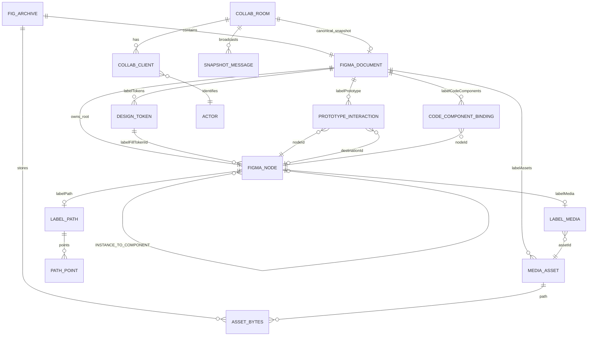

# LabelStudio v1.1.0

> 코딩, 디자인, 미디어 편집과 보정까지.<br />
> 그 모든 것을 한 곳에서.<br />
> 당신을 위한, 당신의 곁에 — LabelStudio.

LabelStudio는 FIG 호환 디자인 편집기, 로컬 미디어 보정 도구, 실시간 협업 서버, Figma Cloud import, 코드 핸드오프를 하나의 작업공간으로 묶습니다.

- Repository: `https://github.com/hslcrb/LabelStudio`
- Product: `LabelStudio`
- Current version: `1.1.0`
- Package name: `labelstudio`
- App ID: `com.hslcrb.labelstudio`
- Default server port: `8787`
- Default Vite port: `5173`

## Product Scope

### Design

- FIG ZIP import/save with additional files preserved
- Frames, rectangles, ellipses, text, lines, sections
- Multi-select, marquee select, move, resize, align, distribute
- Group/ungroup, components, instances, detach
- Auto Layout: horizontal/vertical, gap, padding, alignment, Hug/Fill subset
- Constraints-based resize
- Pen tool with line and cubic Bezier anchors
- Limited Union/Subtract for two sibling shapes
- Prototype Preview with Navigate and Back
- Undo/redo and keyboard movement

### Media

- PNG, JPEG, WebP import
- Media Library and canvas placement
- Original asset bytes stored in FIG ZIP extra files
- Crop, Fit, Stretch
- Non-destructive brightness, contrast, saturation, grayscale, blur
- Asset metadata, alt text and handoff warnings

### Code

- Design, Media and Code workspace modes
- HTML, React, CSS, token CSS and JSON manifest
- Deterministic handoff ZIP
- Semantic HTML, accessible name and component import contract
- Blocker/warning/info readiness report
- SVG, PNG and JSON export

### Collaboration and Cloud

- Optional local/server-authoritative real-time room sync over WebSocket
- Snapshot broadcast with reconnect-safe client connection status
- REST health and document snapshot endpoints
- Figma Cloud read/import through a server-side `FIGMA_ACCESS_TOKEN`
- Figma access tokens never belong in the Vite client bundle

## User Flow

```text
New board or .fig import
        |
        v
D Design workspace -----> M Media workspace -----> C Code workspace
        |                        |                         |
        +-------- Canvas <-------+------ Inspector -------+
                                  |
                                  v
                    FIG / JSON / SVG / PNG / Handoff ZIP
```

Keyboard modes:

- `D`: Design workspace
- `M`: Media workspace
- `C`: Code workspace
- `V`: Select
- `F`: Frame
- `R`: Rectangle
- `O`: Ellipse
- `T`: Text
- `P`: Pen
- `Enter`: Finish an open Pen path
- `Escape`: Cancel Pen draft or leave Preview
- `Ctrl/Cmd+S`: Save `.fig`
- `Ctrl/Cmd+O`: Open `.fig`
- `Ctrl/Cmd+Z`: Undo
- `Ctrl/Cmd+Shift+Z` or `Ctrl/Cmd+Y`: Redo
- `Ctrl/Cmd+D`: Duplicate selection
- `Delete` / `Backspace`: Delete selection
- Arrow keys: Move 1px
- `Shift` + Arrow: Move 10px

## Data ERD

The `.fig` file is a ZIP archive. The document model is a recursive JSON tree, not a relational database. The ERD below describes the persisted relationships and IDs.



### Persisted JSON entities

`FigmaDocument`

```text
name: string
version?: string
lastModified?: string
schemaVersion?: number
labelTokens?: DesignToken[]
labelAssets?: Record<string, MediaAsset>
labelCodeComponents?: CodeComponentBinding[]
labelPrototype?: PrototypeInteraction[]
labelSync?: { source, fileKey, remoteVersion, importedAt }
```

`FigmaNode`

```text
type, id, name
x, y, width, height, rotation
visible, opacity
fills, strokes, effects
constraints, layoutMode, itemSpacing, padding*
children?
labelPath?
labelMedia?
labelSemantic?, labelAccessibleName?
labelComponentId?, labelComponentName?, labelImportPath?
studioGlass?
```

`MediaAsset`

```text
id: asset-<hash>
path: images/<hash>.<extension>
originalName: string
mimeType: image/png | image/jpeg | image/webp
width: number
height: number
byteLength: number
```

`LabelMedia`

```text
assetId: string
crop: { x, y, width, height } // normalized 0..1
adjustments: { brightness, contrast, saturation, grayscale, blur }
alt?: string
```

`LabelPath`

```text
version: 1
fillRule: NONZERO | EVENODD
closed: boolean
points: PathPoint[]
subpaths?: PathPoint[][]
```

Path handles are relative vectors: `handleIn` and `handleOut` are not absolute document coordinates.

## Color System

LabelStudio intentionally uses only lime, light yellow, charcoal, white and black for its own product language. Imported FIG paint values are preserved for file compatibility; new LabelStudio boards and UI use the palette below.

### Product palette

| Role | Hex | Usage |
|---|---:|---|
| Black | `#050505` | App background, primary dark |
| Charcoal 900 | `#111111` | Canvas and code surface |
| Charcoal 850 | `#1B1B1B` | Deep panel surface |
| Charcoal 800 | `#242424` | Glass panel base |
| Charcoal 700 | `#333333` | Elevated surface |
| White | `#FFFFFF` | Primary text and light surfaces |
| Light yellow | `#FFF4A3` | Secondary text, warnings, highlight |
| Lime | `#D9FF4A` | Focus, selection, primary action, LIVE state |

### UI CSS variables

Defined in `src/styles.css`:

```css
--ink-950: #050505;
--ink-900: #111111;
--ink-850: #1B1B1B;
--ink-800: #242424;
--ink-700: #333333;
--mist-100: #FFFFFF;
--mist-200: #FFF4A3;
--mist-300: #FFFFFF;
--muted: #FFF4A3;
--quiet: #FFFFFF;
--sea: #D9FF4A;
--sea-strong: #D9FF4A;
--clay: #FFF4A3;
--sun: #FFF4A3;
--danger: #D9FF4A;
--glass: rgba(36, 36, 36, 0.9);
--glass-soft: rgba(51, 51, 51, 0.7);
```

### Document design tokens

Defined in `src/types/design.ts` and persisted as `FigmaDocument.labelTokens`:

| ID | Name | Type | Value | Export variable |
|---|---|---|---:|---|
| `color-ink` | `color.ink` | COLOR | `#111111` | `--ls-color-ink` |
| `color-charcoal` | `color.charcoal` | COLOR | `#292929` | `--ls-color-charcoal` |
| `color-lime` | `color.lime` | COLOR | `#D9FF4A` | `--ls-color-lime` |
| `color-yellow` | `color.lightYellow` | COLOR | `#FFF4A3` | `--ls-color-lightyellow` |
| `color-white` | `color.white` | COLOR | `#FFFFFF` | `--ls-color-white` |
| `space-4` | `space.4` | NUMBER | `4px` | `--ls-space-4` |
| `space-8` | `space.8` | NUMBER | `8px` | `--ls-space-8` |
| `space-16` | `space.16` | NUMBER | `16px` | `--ls-space-16` |
| `radius-12` | `radius.12` | NUMBER | `12px` | `--ls-radius-12` |

UI variables and document tokens are intentionally separate. UI variables define LabelStudio itself; document tokens define the user design being exported.

## Commands

### Prerequisites

- Windows, macOS or Linux
- Node.js `20.19+` or `22.12+`
- npm `10+`
- Internet connection for first dependency install and Electron builder downloads

### Install

```powershell
npm ci
```

Use `npm install` only when intentionally changing dependencies or the lockfile.

### Browser development

```powershell
npm run dev
```

Open `http://localhost:5173`.

Use another Vite port:

```powershell
npm run dev -- --port 5174
```

### Production web build

```powershell
npm run build
npm run preview
```

`vite preview` serves the generated `dist/` directory, normally at `http://localhost:4173`.

### Quality checks

```powershell
npm run build
npm run lint
npm test
npm run server:typecheck
```

### Collaboration server

Terminal 1:

```powershell
npm run server:dev
```

Terminal 2:

```powershell
npm run dev
```

The renderer's `LIVE` button connects to `ws://localhost:8787` by default. Health check:

```powershell
Invoke-RestMethod http://localhost:8787/healthz
```

Run the server without file watching:

```powershell
npm run server
```

The P0 server is an in-memory, server-authoritative snapshot room. It is intended for local/LAN development and must be backed by a database, authentication and object storage before public deployment.

### Electron development

The cross-platform script uses `cross-env`:

```powershell
npm run dev
npm run electron:dev
```

Equivalent explicit PowerShell flow:

```powershell
$env:VITE_DEV_SERVER_URL = "http://localhost:5173"
```

Packaged local run:

```powershell
Remove-Item Env:VITE_DEV_SERVER_URL -ErrorAction SilentlyContinue
npm run build
npm exec electron -- .
```

### Windows packaging

Installer EXE:

```powershell
npm run dist:win
```

Expected output:

```text
release/LabelStudio Setup 1.1.0.exe
```

Windows ZIP:

```powershell
npm run dist:win:zip
```

Portable EXE:

```powershell
npm run dist:win:portable
```

The generated binaries are unsigned unless `CSC_LINK` and `CSC_KEY_PASSWORD` are configured. Windows SmartScreen may show a warning for unsigned builds.

### Linux packaging

```powershell
npm run dist:linux
```

### GitHub Release

Check the version first:

```powershell
$version = node -p "require('./package.json').version"
Write-Output $version
```

After committing and pushing the tag:

```powershell
git tag v1.1.0
git push origin main
git push origin v1.1.0
npm run dist:win
gh release create v1.1.0 (Get-ChildItem -LiteralPath .\release -Filter *.exe | Select-Object -ExpandProperty FullName) --title "LabelStudio v1.1.0" --notes "LabelStudio code-first design, media editing and collaboration release."
```

For a release with multiple artifacts:

```powershell
gh release upload v1.1.0 .\release\*.exe .\release\*.blockmap --clobber
```

Do not publish tokens or signing credentials. `gh auth status` must show an account with release permission.

## Environment Variables

### Renderer/public configuration

These values may be included in the Vite bundle and must not contain secrets.

```dotenv
VITE_DEV_SERVER_URL=http://localhost:5173
VITE_API_BASE_URL=http://localhost:8787
VITE_COLLAB_WS_URL=ws://localhost:8787
```

### Collaboration/Figma server configuration

These values belong only to the Node server environment.

```dotenv
PORT=8787
ALLOWED_ORIGINS=http://localhost:5173
FIGMA_ACCESS_TOKEN=your-server-side-token
```

Never create `VITE_FIGMA_ACCESS_TOKEN`. Any `VITE_*` value is visible to the renderer.

Figma Cloud import:

```powershell
$env:FIGMA_ACCESS_TOKEN = "..."
npm run server:dev
```

Then use `Cloud` in the LabelStudio toolbar and enter a Figma file key.

## Storage and Security

- There is no automatic local save to `localStorage` or IndexedDB.
- Unsaved changes live in memory until `.fig` save or another export.
- `.fig` is a ZIP with `.fig.json` and optional asset bytes.
- The collaboration server currently keeps canonical snapshots in memory.
- Collaboration messages are full-document snapshots in v1.1.0, not CRDT operations.
- Do not expose Figma tokens or signing keys in the Vite renderer.
- Public collaboration deployment requires authentication, authorization, persistence, asset storage, rate limits and audit logging.
- Figma Cloud support is read/import and manual refresh; writing back to Figma requires a Figma Plugin bridge.

## Handoff ZIP

The Code workspace and Toolbar export generate:

```text
<document>-handoff.zip
├── index.html
├── styles.css
├── tokens.css
├── components/LabelStudioBoard.tsx
├── handoff.manifest.json
├── README.md
└── assets/*
```

The package is deterministic for the same document metadata and includes only referenced assets. Code is read-only output; edit the source design or use an external codebase mapping rather than treating generated code as a second source of truth.

## Source Layout

```text
src/
├── components/
│   ├── CanvasView.tsx
│   ├── CodeHandoffView.tsx
│   ├── Inspector.tsx
│   ├── LayersPanel.tsx
│   ├── MediaPanel.tsx
│   ├── PreviewView.tsx
│   └── Toolbar.tsx
├── domain/
│   ├── AutoLayoutEngine.ts
│   ├── CodeExporter.ts
│   ├── DesignExporter.ts
│   ├── EditorSession.ts
│   └── MediaAssetService.ts
├── infra/
│   ├── CollaborationClient.ts
│   └── FigmaCloudClient.ts
├── lib/
│   ├── boolean.ts
│   ├── figma.ts
│   ├── matrix.ts
│   ├── path.ts
│   ├── render.ts
│   └── zip.ts
├── store/editor.ts
└── types/
    ├── collaboration.ts
    ├── design.ts
    └── figma.ts
server/
└── index.ts
electron/
└── main.mjs
```

## Known Scope

Implemented in v1.1.0:

- Pen/Bezier path creation and persistence
- Limited Boolean Path composition
- Local media edit and non-destructive correction
- Code-first export
- Optional local collaboration room
- Server-side Figma Cloud read/import adapter

Not yet a production collaboration platform:

- No CRDT or field-level conflict resolution
- No persistent collaboration database
- No OAuth login or multi-tenant permissions
- No Figma write-back without a Plugin bridge
- No real-time cursor/presence service

These limitations are deliberate boundaries of the v1.1.0 local-first release.
